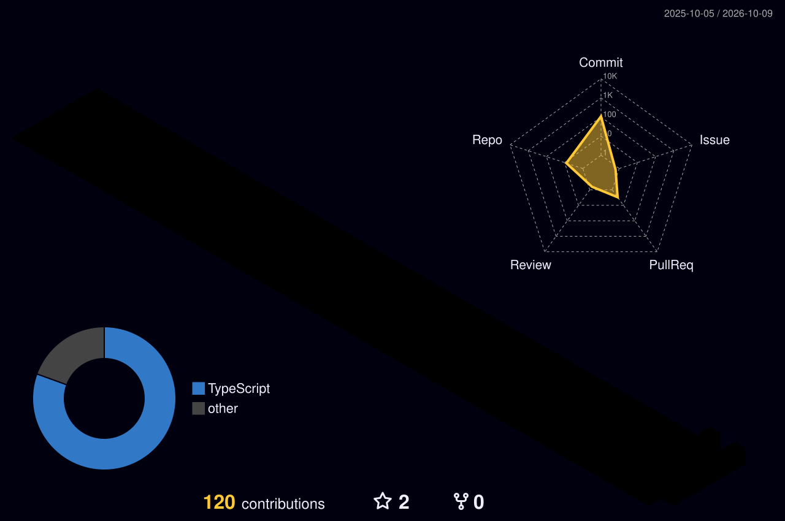

<div align="center">


<br/>


</div>

<br/>

## ⚡ whoami

```js
const devendra = {
  role: "BE CSE Student (2025 - 2029)",
  college: "PES Institute of Technology & Management",
  location: "Shivamogga, Karnataka, India",
  building: ["CampusOne", "CareerDNA", "FoodWise"],
  focus: ["Full-Stack Web", "Mobile Apps", "AI-powered products"],
  learning: ["Data Structures & Algorithms", "Advanced React Native"],
  motto: "Building. Learning. Evolving."
};
```

<br/>

## 🛠️ Tech Arsenal

<table>
  <tr>
    <td><b>Frontend</b></td>
    <td></td>
  </tr>
  <tr>
    <td><b>Backend</b></td>
    <td></td>
  </tr>
  <tr>
    <td><b>Database & Cloud</b></td>
    <td></td>
  </tr>
  <tr>
    <td><b>Tools</b></td>
    <td></td>
  </tr>
</table>

<br/>

## 🚀 Featured Projects

<div align="center">

<a href="https://github.com/devendrasankhla01/Classora">
  
</a>
<a href="https://github.com/devendrasankhla01/CareerDNA">
  
</a>
<a href="https://github.com/devendrasankhla01/foodwise">
  
</a>
<a href="https://github.com/devendrasankhla01/Drishti-Predictive_AI_Agent">
  
</a>

</div>

<details>
<summary><b>📖 What each project does (click to expand)</b></summary>
<br/>

- 🎓 **[CampusOne (Classora)](https://classora-tau.vercel.app)**: offline-first PWA for attendance and timetables, with student, faculty, HOD and principal portals.
- 🧬 **CareerDNA**: AI placement-readiness predictor with student, faculty and TPO dashboards.
- 🍽️ **[FoodWise](https://foodwise-peach.vercel.app)**: food-waste management platform with demand forecasting and surplus redistribution (hackathon prototype).
- 👁️ **Drishti**: real-time predictive maintenance and digital twin dashboard.

</details>

<br/>

## 🏆 Hackathons

- **Smart India Hackathon (SIH)**: Team *Anvay, Connected to Create*, built **FoodWise** (PS 26234)

<br/>

## 📊 GitHub Analytics

<div align="center">


</div>

<br/>


## 🌆 3D Contribution Skyline

<div align="center">
  
</div>
## 🐍 Contribution Snake

<div align="center">
  <picture>
    <source media="(prefers-color-scheme: dark)" srcset="https://raw.githubusercontent.com/devendrasankhla01/devendrasankhla01/output/github-snake-dark.svg" />
    
  </picture>
</div>

<br/>

## 🤝 Let's Connect

<div align="center">

<a href="https://linkedin.com/in/devendrasankhla"></a>
<a href="mailto:devendrasankhla8@gmail.com"></a>
<a href="https://instagram.com/devendra_sankhlaa"></a>

</div>


